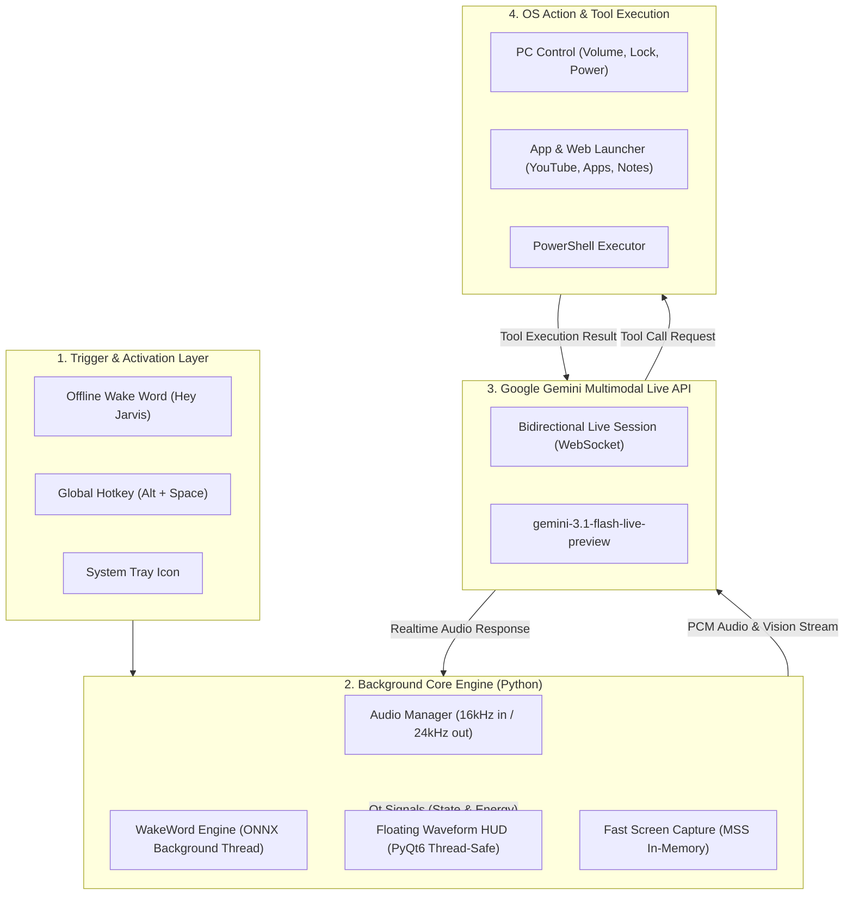

<div align="center">

# 🎙️ Project J.A.R.V.I.S.
### *Real-Time Native Windows AI Voice Assistant*

[](https://www.python.org/)
[](https://ai.google.dev/)
[](https://riverbankcomputing.com/software/pyqt/)
[-0078D6?style=for-the-badge&logo=windows&logoColor=white)](https://microsoft.com/windows)
[](LICENSE)

*J.A.R.V.I.S. (Just A Rather Very Intelligent System) adalah asisten suara AI native Windows dengan latensi ultra-rendah (< 500 ms) yang beroperasi hening di background. Ditenagai oleh Google Gemini Multimodal Live API, J.A.R.V.I.S. menghadirkan percakapan dua arah berkelanjutan (hands-free multi-turn), penglihatan layar (screen vision), kontrol sistem operasi Windows, dan otomatisasi desktop.*

---

[Fitur Utama](#-fitur-utama) •
[Arsitektur](#-arsitektur-sistem) •
[Instalasi](#-panduan-instalasi) •
[Cara Penggunaan](#-cara-penggunaan) •
[Daftar Perintah & Tools](#-daftar-perintah--tools) •
[Konfigurasi](#-konfigurasi) •
[Pengujian](#-pengujian-otomatis)

---

</div>

## 🌟 Fitur Utama

### ⚡ 1. Audio-to-Audio Ultra-Low Latency (Sub-500ms)
- **Direct Native Streaming**: Menggunakan protokol WebSocket dua arah ke **Google Gemini Multimodal Live API** (`gemini-3.1-flash-live-preview`) tanpa konversi teks perantara (STT $\to$ LLM $\to$ TTS konvensional yang lambat).
- **Barge-in / Interruption Handling**: Anda dapat memotong/menyela JARVIS di tengah kalimat; output audio JARVIS akan langsung berhenti dan sistem seketika mendengarkan instruksi baru.
- **Acoustic Echo Suppression**: Mengabaikan suara speaker saat JARVIS berbicara agar mikrofon tidak menangkap suaranya sendiri.

### 🗣️ 2. Hands-Free Multi-Turn Continuous Conversation
- **Percakapan Berkelanjutan**: Setelah JARVIS menjawab pertanyaan pertama, mikrofon tetap aktif mendengarkan pertanyaan berikutnya tanpa perlu menekan tombol lagi.
- **Voice Dismissal & Standby**: Cukup katakan *"I'll call you later"*, *"Cukup Jarvis"*, *"Standby"*, atau *"Tidur Jarvis"*, dan JARVIS akan pamit secara sopan lalu kembali ke mode siaga hemat daya.
- **Spurious Dismissal Guardrails**: Dilengkapi filter pencegah salah tutup sesi jika Anda sedang memberikan perintah (seperti *"buka yt"* atau *"catat di notepad"*).

### 🎙️ 3. Aktivasi Fleksibel (Offline Wake Word & Global Hotkeys)
- **Offline Wake Word**: Deteksi lokal *"Hey Jarvis"* menggunakan model ONNX `openwakeword` yang berjalan hemat daya tanpa mengirim data suara ke cloud saat standby.
- **Global Hotkeys**:
  - `Alt + Space` : Aktivasi utama instan dari aplikasi mana pun.
  - `Win + Shift + J` : Hotkey alternatif.
  - `Escape` : Membatalkan sesi dan langsung kembali ke mode siaga (*Standby*).

### 🖥️ 4. Floating Glowing Waveform HUD & System Tray
- **Minimalist HUD**: Widget animasi visualizer gelombang suara transparan (PyQt6) di bagian bawah layar yang berubah warna dinamis sesuai status (*Idle*, *Listening*, *Thinking*, *Speaking*).
- **Click-Through & Non-Intrusive**: Overlay tidak menghalangi klik mouse ke jendela aplikasi kerja di belakangnya.
- **System Tray**: Ikon Arc Reactor cyan di tray Windows untuk pemantauan status dan menu kontrol cepat.

### 👁️ 5. Screen Vision & Multimodal Perception
- **In-Memory Frame Buffer**: Mengambil tangkapan layar instan menggunakan `mss` tanpa menulis file ke disk (0 disk overhead).
- **Analisis Layar Real-Time**: Tanyakan langsung apa yang ada di layar: *"Jarvis, baca kode yang error ini"*, *"Rangkum jendela yang aktif"*, atau *"Analisis grafik ini"*.

### ⚙️ 6. Otomatisasi Desktop & Windows Control
- **Peluncur Aplikasi & Web Apps**: Membuka software desktop (VS Code, Chrome, Spotify, Discord, MOZA Pit House, OBS, Calculator) atau web app langsung (YouTube/YT, Gmail, GitHub, WhatsApp Web, ChatGPT).
- **Kontrol Sistem**: Mengatur volume sistem Windows, mengunci PC (*Lock Workstation*), sleep, reboot, atau shutdown dengan konfirmasi aman.
- **Pencatatan & Pengetikan Otomatis**:
  - `write_to_notepad`: Membuat catatan teks dan langsung membukanya di Windows Notepad.
  - `type_text`: Mengetikkan teks secara otomatis ke kursor jendela yang sedang aktif.
- **Eksekusi PowerShell**: Menjalankan skrip otomasi developer dengan perlindungan filter guardrails keamanan.

---

## 🏗️ Arsitektur Sistem



---

## 📂 Struktur Repositori

```text
JarvisAPP/
├── assets/
│   ├── chime_in.wav              # Suara audio cue aktivasi
│   ├── chime_out.wav             # Suara audio cue selesai / standby
│   └── tray_icon.png             # Ikon Arc Reactor untuk system tray
├── config/
│   ├── settings.json             # Konfigurasi hotkey, voice, model, dan audio
│   └── system_prompt.txt         # Persona, etika butler, dan aturan eksekusi tools
├── scripts/
│   └── generate_assets.py        # Generator aset audio dan ikon prosedural
├── src/
│   ├── core/
│   │   ├── audio_manager.py      # Streamer I/O audio (sounddevice), VAD & AEC
│   │   ├── live_client.py        # Klien WebSocket Gemini Multimodal Live API
│   │   └── wakeword_engine.py    # Mesin deteksi offline openWakeWord & hotkeys
│   ├── gui/
│   │   ├── hud_overlay.py        # Widget HUD animasi gelombang suara (PyQt6)
│   │   └── system_tray.py        # Integrasi notification tray Windows
│   └── tools/
│       ├── app_launcher.py       # Peluncur aplikasi, web apps, dan note writer
│       ├── pc_control.py         # Volume, power, lock workstation, status PC
│       ├── screen_capture.py     # Fast in-memory screenshot untuk Gemini Vision
│       └── system_exec.py        # PowerShell executor dengan guardrails keamanan
├── tests/                        # 21 unit & integration tests (Pytest)
├── main.py                       # Entry point aplikasi dengan konsol logging
├── main.pyw                      # Entry point silent background daemon (tanpa konsol)
├── install_startup.bat           # Skrip instalasi otomatis ke Windows Startup
├── run_tests.py                  # Runner diagnostik & pengujian komprehensif
├── requirements.txt              # Daftar dependensi Python
└── prd.md                        # Product Requirement Document lengkap
```

---

## 🚀 Panduan Instalasi

### 1. Prasyarat Sistem
- **Sistem Operasi**: Windows 10 (Build 19041+) atau Windows 11 (64-bit).
- **Python**: Python 3.11 atau 3.12 (64-bit).
- **Google Gemini API Key**: Dapatkan secara gratis di [Google AI Studio](https://aistudio.google.com/).

### 2. Kloning Repositori
```powershell
git clone https://github.com/azharsyarif/TaeyeonApp-Jarvis-reference-project.git
cd TaeyeonApp-Jarvis-reference-project
```

### 3. Setup Virtual Environment & Dependensi
```powershell
# Buat virtual environment
python -m venv .venv

# Aktifkan virtual environment
.venv\Scripts\activate

# Install semua dependensi
pip install -r requirements.txt
```

### 4. Konfigurasi API Key
Salin file `.env.example` menjadi `.env` lalu isi dengan API key Gemini Anda:
```powershell
copy .env.example .env
```
Buka file `.env` dan masukkan API Key:
```env
GEMINI_API_KEY=AIzaSyYourGeminiApiKeyHere
```

---

## 🎮 Cara Penggunaan

### Menjalankan dalam Mode Konsol (Development & Debugging)
```powershell
python main.py
```
*Gunakan mode ini untuk melihat transcript ucapan real-time dan log aktivitas tool.*

### Menjalankan dalam Mode Silent Daemon (Produksi)
```powershell
pythonw main.pyw
```
*Aplikasi akan berjalan hening di latar belakang tanpa jendela terminal dan langsung memunculkan ikon Arc Reactor di System Tray.*

### Menjalankan Otomatis Saat Windows Dinyalakan (Auto-Start)
Cukup klik dua kali file **`install_startup.bat`** atau jalankan lewat terminal:
```powershell
.\install_startup.bat
```
*Skrip ini akan menambahkan shortcut JARVIS ke folder Windows Startup Anda.*

---

## 💬 Daftar Perintah & Tools

| Kategori | Contoh Ucapan Suara | Aksi yang Dilakukan |
| :--- | :--- | :--- |
| **Aplikasi Desktop** | *"Buka VS Code"*, *"Buka Chrome"*, *"Buka Spotify"*, *"Buka MOZA Pit House"* | Meluncurkan aplikasi desktop dari shortcut atau Start Menu Windows. |
| **Web Apps & Situs** | *"Buka YT"*, *"Buka YouTube"*, *"Buka GitHub"*, *"Buka Gmail"*, *"Buka WhatsApp"* | Membuka situs/web app langsung di browser default. |
| **Kontrol Volume** | *"Naikkan volume 10 persen"*, *"Kecilkan volume"*, *"Mute suara"* | Mengatur volume audio Windows secara native. |
| **Screen Vision** | *"Jarvis, baca kode yang error ini"*, *"Apa yang ada di layar saya?"* | Mengambil tangkapan layar instan dan menganalisisnya dengan Gemini Vision. |
| **Catatan & Mengetik** | *"Tulis di notepad ide proyek hari ini"*, *"Ketik teks ini di kursor"* | Menulis catatan ke file di Desktop dan membukanya di Notepad, atau mengetik langsung. |
| **Status Sistem** | *"Bagaimana status komputer saya?"*, *"Berapa persen baterai?"* | Melaporkan beban CPU, sisa RAM, dan persentase baterai. |
| **Keamanan PC** | *"Kunci komputer saya"* | Mengunci workstation Windows (`LockWorkStation`). |
| **Power Control** | *"Tidurkan komputer"* / *"Matikan PC"* | Mengaktifkan mode Sleep atau Shutdown (dengan konfirmasi keamanan). |
| **Voice Dismissal** | *"I'll call you later"*, *"Cukup Jarvis"*, *"Dah Jarvis"*, *"Standby"* | Mengakhiri sesi obrolan secara sopan dan kembali ke mode siaga. |

---

## ⚙️ Konfigurasi

Semua pengaturan utama dapat disesuaikan di file [`config/settings.json`](config/settings.json):

```json
{
  "activation": {
    "hotkey": "alt+space",
    "secondary_hotkey": "windows+shift+j",
    "wake_word": "hey jarvis",
    "wake_word_enabled": true
  },
  "gemini": {
    "model": "gemini-3.1-flash-live-preview",
    "voice": "Puck"
  },
  "audio": {
    "input_sample_rate": 16000,
    "output_sample_rate": 24000,
    "vad_energy_threshold": 0.015
  },
  "hud": {
    "theme": "arc_reactor",
    "position": "bottom_center",
    "width": 320,
    "height": 60
  }
}
```

- **Pilihan Suara (`voice`)**: `Puck`, `Charon`, `Kore`, `Fenrir`, `Aoede`.
- **Persona & Gaya Bicara**: Dapat dikustomisasi langsung melalui file [`config/system_prompt.txt`](config/system_prompt.txt).

---

## 🧪 Pengujian Otomatis

Proyek ini dilengkapi dengan **21 unit & integration tests** otomatis yang mencakup pengujian audio, konfigurasi, GUI HUD, deklarasi Gemini Live Client, peluncur aplikasi, dan guardrails keamanan:

```powershell
python run_tests.py
```

Output:
```text
============================= 21 passed in 2.67s ==============================
============================================================
   JARVIS WINDOWS VOICE ASSISTANT - DIAGNOSTIC & TEST RUNNER
============================================================
[1/3] Environment & Dependency Check: [OK]
[2/3] Asset & Configuration Check   : [OK]
[3/3] Executing Automated Pytest Suite:
[SUCCESS] All JARVIS tests passed flawlessly!
```

---

## 🔒 Privasi & Keamanan

1. **Mikrofon Hanya Mengirim saat Aktif**: Saat dalam mode *standby*, hanya modul offline `openwakeword` lokal yang berjalan di perangkat Anda. **Tidak ada rekaman suara yang dikirim ke cloud sebelum hotkey atau wake word dipicu.**
2. **Kerahasiaan API Key**: File `.env` secara ketat diabaikan oleh `.gitignore` dan dilindungi dari commit publik.
3. **Eksekusi Aman**: Perintah destruktif (seperti mematikan komputer atau perintah terminal berisiko tinggi) memerlukan konfirmasi eksplisit dari pengguna.

---

## 📄 Lisensi

Proyek ini dilisensikan di bawah [MIT License](LICENSE).

<div align="center">
<i>"Sometimes you gotta run before you can walk." — Tony Stark</i>
</div>