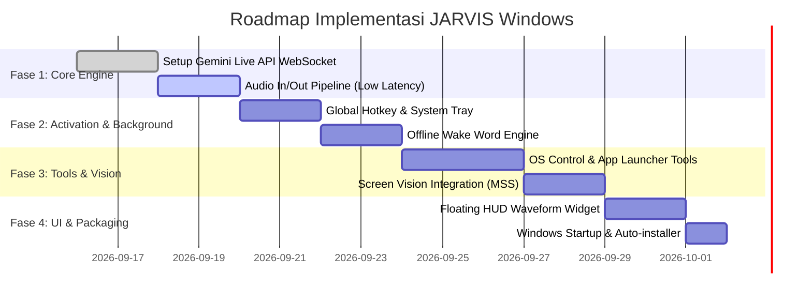

# Product Requirement Document (PRD)
# Project: JARVIS – Real-Time Windows AI Voice Assistant

| Detail Dokumen | Informasi |
| :--- | :--- |
| **Nama Proyek** | Project JARVIS (Windows Native Voice Assistant) |
| **Versi** | v1.0.0 |
| **Target OS** | Windows 10 / Windows 11 (x64) |
| **AI Engine** | Google Gemini Multimodal Live API (`gemini-3.1-flash-live-preview`) |
| **Status** | Approved for Implementation |

---

## 1. Executive Summary & Visi Produk

### 1.1 Visi
Membangun asisten AI berbasis suara yang terintegrasi secara *native* di sistem operasi Windows, beroperasi hening di latar belakang (*background daemon*), dan memberikan pengalaman percakapan dua arah secara *real-time* tanpa jeda terasa (latensi $\le 500\text{ ms}$). Pengguna dapat memanggil asisten kapan saja melalui *hotkey* global atau *wake word*, berinteraksi secara hands-free, mengontrol sistem operasi, serta meminta analisis visual layar (*Screen Vision*).

### 1.2 Problem Statement
- **Latensi Tinggi pada Solusi Konvensional**: Model STT $\to$ LLM $\to$ TTS tradisional memakan waktu 2–4 detik, merusak dinamika percakapan alami.
- **Friksi Akses**: Sebagian besar AI mengharuskan pengguna membuka browser, membuka aplikasi terpisah, atau mengetik di antarmuka chat.
- **Ketiadaan Integrasi OS**: Asisten suara web tidak memiliki akses untuk membuka file, menjalankan perintah sistem, atau melihat apa yang sedang aktif di layar pengguna.

---

## 2. Arsitektur Sistem

```mermaid
flowchart TB
    subgraph Trigger_Layer ["1. Trigger & Activation Layer"]
        WW["Offline Wake Word ('Hey Jarvis')"]
        HK["Global Hotkey (Alt + Space)"]
        ST["System Tray Icon"]
    end

    subgraph Core_Engine ["2. Background Core Engine (pythonw)"]
        VAD["Voice Activity Detection (Silero VAD)"]
        AudioIO["PCM Audio Streamer (16kHz in / 24kHz out)"]
        HUD["Floating HUD Overlay (PyQt6 / Transparan)"]
        ScreenCap["Fast Screen Capture (MSS)"]
    end

    subgraph Cloud_AI ["3. Google Gemini Live API (WebSocket)"]
        LiveSession["Bidirectional Audio & Vision Session"]
        Model["gemini-3.1-flash-live-preview"]
    end

    subgraph Action_Layer ["4. OS Action & Tool Execution"]
        PowerShell["PowerShell / Terminal Execution"]
        AppLauncher["App & Browser Launcher"]
        MediaControl["Volume & Media Controller"]
    end

    Trigger_Layer --> Core_Engine
    Core_Engine <-->|WebSockets (Sub-500ms)| Cloud_AI
    Cloud_AI -->|Tool Call Request| Action_Layer
    Action_Layer -->|Tool Call Result| Cloud_AI
    Core_Engine -->|Render State| HUD
```

---

## 3. Fitur Utama & Functional Requirements (FR)

### FR-1: Background Daemon & Mekanisme Pemicu (Activation)
- **FR-1.1 (Silent Background)**: Aplikasi berjalan di background tanpa membuka jendela CMD/Terminal (`pythonw.exe`), meminimalkan penggunaan resource saat *standby*.
- **FR-1.2 (System Tray Integration)**: Ikon di area notifikasi (System Tray) untuk status aktif, pengaturan cepat, dan tombol *Quit*.
- **FR-1.3 (Global Hotkey)**: Menekan tombol pintas global (default: `Alt + Space` atau `Win + Shift + J`) langsung mengaktifkan mikrofon dan memicu sesi percakapan dari aplikasi mana pun.
- **FR-1.4 (Offline Wake Word)**: Mendukung deteksi kata pemicu ("Hey Jarvis") secara lokal/offline menggunakan model hemat daya (*openWakeWord* / *Porcupine*).
- **FR-1.5 (Audio Cue / Chime)**: Memberikan feedback bunyi *chime* halus yang khas saat asisten mulai mendengarkan dan saat sesi selesai.

### FR-2: Audio Streaming Dua Arah Ultra-Low Latency
- **FR-2.1 (Native Audio-to-Audio)**: Menggunakan Gemini Multimodal Live API untuk streaming audio PCM langsung tanpa konversi teks perantara.
- **FR-2.2 (Barge-in / Interruption Handling)**: Pengguna dapat menyela atau memotong pembicaraan Jarvis di tengah kalimat; output audio Jarvis akan langsung berhenti dan sistem mendengarkan input baru.
- **FR-2.3 (Adaptive VAD)**: Otomatis mendeteksi akhir kalimat pengguna untuk transisi respon yang instan dan mulus.

### FR-3: Floating Visual HUD (Overlay Antarmuka)
- **FR-3.1 (Minimalist Floating Widget)**: Widget animasi gelombang suara (waveform/glowing pill) transparan di bagian bawah/tengah layar saat sesi aktif.
- **FR-3.2 (Click-Through & Non-Intrusive)**: Overlay tidak memblokir klik mouse ke aplikasi kerja di belakangnya dan otomatis menghilang saat sesi selesai (*idle*).

### FR-4: Screen Vision & Multimodal Perception
- **FR-4.1 (Instant Screen Capture)**: Mengambil tangkapan layar instan (*in-memory frame buffer*) saat pengguna bertanya tentang konten di layar (misal: *"Jarvis, baca kode yang error ini"* atau *"Rangkum grafik ini"*).
- **FR-4.2 (Zero File Overhead)**: Gambar dikirim langsung sebagai *binary blob* ke Gemini Live Session tanpa disimpan ke disk.

### FR-5: Otomatisasi Sistem Operasi & Eksekusi Tools
- **FR-5.1 (App & URL Launcher)**: Membuka aplikasi sistem (VS Code, Chrome, Spotify) atau URL spesifik berdasarkan perintah suara.
- **FR-5.2 (System Control)**: Mengatur volume, mengunci workstation, mematikan/merestart PC dengan konfirmasi.
- **FR-5.3 (CLI / Script Execution)**: Menjalankan perintah PowerShell / Bash secara terisolasi untuk tugas automasi developer.

### FR-6: Persona & Karakteristik JARVIS
- **FR-6.1 (Tone of Voice)**: Sopan, profesional, ringkas, cerdas, tidak bertele-tele, menyapa dengan *'Sir'*.
- **FR-6.2 (Voice Selection)**: Menggunakan suara natural berkualitas tinggi dari Gemini Live (seperti `Puck` atau `Fenrir`).

---

## 4. Non-Functional Requirements (NFR)

| Kategori | Target Spesifikasi |
| :--- | :--- |
| **Latency (TTFB)** | $< 500\text{ ms}$ (dari akhir ucapan pengguna hingga audio pertama terdengar) |
| **Memory Footprint (Standby)** | $< 120\text{ MB RAM}$ |
| **CPU Usage (Idle/Standby)** | $< 1.0\%$ CPU |
| **Network Overhead** | Kompresi raw PCM 16kHz mono (optimasi bandwidth hemat) |
| **Keamanan** | API Key disimpan aman di Environment Variables atau Windows Credential Locker |
| **Kompatibilitas** | Windows 10 (Build 19041+) & Windows 11 |

---

## 5. Technology Stack & Dependencies

```
+-------------------------------------------------------------+
|                     JARVIS Windows Client                   |
+-------------------------------------------------------------+
| Language & Runtime  : Python 3.11+ (x64)                    |
| AI SDK              : google-genai (v1alpha / Live API)     |
| Audio Pipeline      : PyAudio (PortAudio), Silero VAD       |
| Wake Word           : openWakeWord (ONNX Engine)            |
| UI / Floating HUD   : PyQt6 (Frameless, WindowStaysOnTop)  |
| OS Hooks & Shortcuts: keyboard, pystray, mss, pygetwindow   |
+-------------------------------------------------------------+
```

---

## 6. Struktur Direktori Proyek

```
jarvis-assistant/
├── assets/
│   ├── chime_in.wav              # Suara aktivasi
│   ├── chime_out.wav             # Suara selesai
│   └── tray_icon.png             # Ikon system tray
├── config/
│   ├── settings.json             # Konfigurasi hotkey, voice, model
│   └── system_prompt.txt         # Persona & instruksi JARVIS
├── src/
│   ├── __init__.py
│   ├── core/
│   │   ├── audio_manager.py      # Streamer I/O mikrofon & speaker
│   │   ├── live_client.py        # WebSocket client Gemini Live API
│   │   └── wakeword_engine.py    # Offline wake word listener
│   ├── gui/
│   │   ├── hud_overlay.py        # Floating waveform visualizer
│   │   └── system_tray.py        # Tray icon menu
│   └── tools/
│       ├── pc_control.py         # Volume, lock, shutdown
│       ├── app_launcher.py       # Start apps & websites
│       └── screen_capture.py     # Fast in-memory screenshot
├── main.pyw                      # Entry point daemon
├── requirements.txt
└── install_startup.bat           # Script otomatis pasang di Windows Startup
```

---

## 7. Roadmap & Tahapan Pengembangan



---

## 8. Pertimbangan Keamanan & Privasi
1. **Mikrofon Hanya Mengirim saat Aktif**: Saat standby, hanya modul wake word lokal (offline) yang mendengarkan. Tidak ada audio yang dikirim ke cloud sebelum hotkey/wake word dipicu.
2. **Sanitasi Perintah Sistem**: Tool eksekusi perintah terminal dibatasi untuk mencegah eksekusi perintah destruktif tanpa konfirmasi verbal pengguna.

